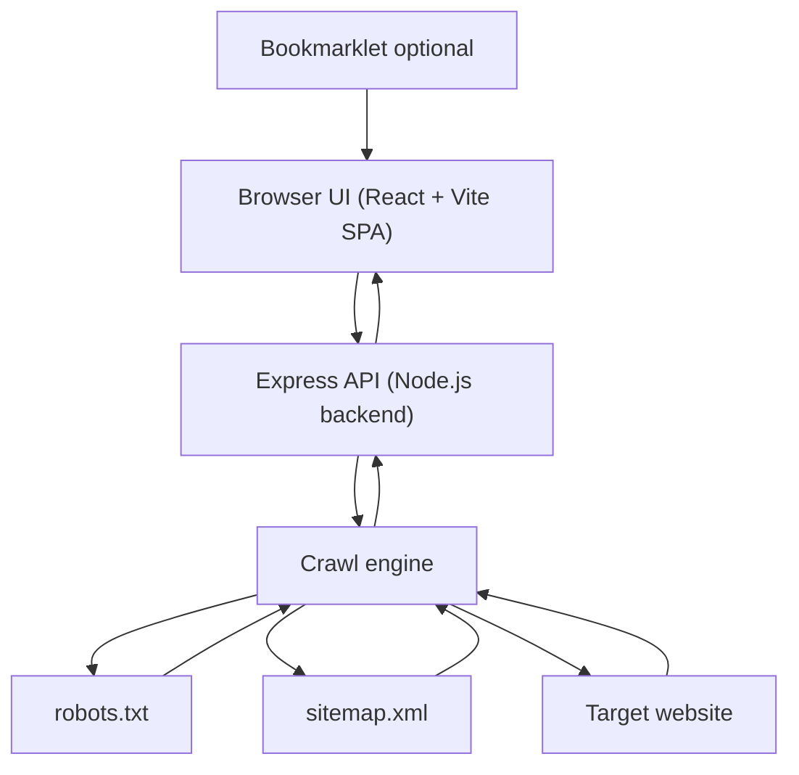

# Site Crawler

> Discover internal URLs with exclusions, redirects, duplicates, presets, language-agnostic path limits, and optional access control.


## Table of contents
- Features
- Live demo
- Tech stack
- How it works
- Architecture diagram
- Functionality deep-dive
- Installation and setup
- API reference
- Configuration and environment variables
- Deploy to Google Cloud Run
- Performance and roadmap
- Bookmarklet (A11y Cat)

---

## Features
- Crawl internal pages from a homepage URL
- Sitemap-first discovery when sitemap.xml is available
- robots.txt respected before fetching any URL
- Same-host crawling with optional scope limited to the start path
- Exclude paths using relative paths, one per line
- Language-agnostic crawl limits by path (for example `/job` also matches `/en/job`, `/fr/job`)
- Ignore job pages by default to prevent job-heavy sections from flooding results
- Redirect resolution with original URL and final URL stored
- Optional broken link quick check with HTTP status recording
- Duplicate content candidates detection, including querystring and language variants
- Client presets saved in localStorage, export and import presets as JSON
- Optional runner access control via server-side pin
- Glass UI with progress ring and animated orb during crawl

---

## Live demo

This project is deployed on Google Cloud Run:

https://site-crawler-909296093050.europe-west2.run.app/

---

## Tech stack

### Frontend
- React 18
- Vite 5
- Vanilla CSS
- Browser APIs: localStorage and sessionStorage

### Backend
- Node.js 22+
- Express
- Cheerio for HTML parsing and link extraction
- robots-parser for robots.txt enforcement
- Built-in fetch and AbortController for HTTP requests and timeouts

### Infrastructure
- Docker
- Google Cloud Run

---

## How it works

### User flow
1. Enter a homepage URL.
2. Add optional exclude paths such as `/jobs`, `/careers`, `/admin`.
3. Define crawl limits by path if required.
4. Configure max pages and concurrency.
5. Choose options such as ignoring job pages or running a broken link check.
6. Unlock the runner if access control is enabled.
7. Run the crawl.
8. Review results and export TXT or CSV if needed.

### Access control
- The frontend checks if a pin is required via `GET /api/config`.
- If enabled, the user must unlock the runner using `POST /api/auth`.
- The pin is never exposed client-side beyond the request and is cleared from the input on success.
- Crawl requests send the pin via the `x-runner-pin` header.
- The backend rejects crawl requests with HTTP 401 if the pin is missing or invalid.

---

## Architecture diagram




---

## Functionality deep-dive

### Crawl pipeline
- The backend validates and normalises the start URL.
- robots.txt is fetched and enforced before crawling any URL.
- sitemap.xml is fetched and used as the initial discovery source when available.
- If no sitemap exists, crawling starts from the provided URL.

### URL filtering and scoping
Each discovered URL is filtered using:
- Same-host enforcement
- Optional restriction to the start path (for example starting at `/en` only crawls `/en/...`)
- Excluded file extensions (images, fonts, media, PDFs, JS, CSS)
- User-defined exclude paths
- Optional job page detection and exclusion

### Language-agnostic path limits
- Path limits are normalised by stripping a leading language segment.
- A rule like `/job` matches `/job`, `/en/job`, `/fr/job`, etc.
- Each rule tracks how many URLs were crawled under that path and stops once the limit is reached.

### Concurrency and progress
- URLs are processed in batches with a configurable concurrency limit.
- The UI displays progress using a time-based progress indicator while crawling.

### Results
- Returned URLs include original URL, final URL after redirects, and optional HTTP status.
- Duplicate candidates are grouped by base URL and flagged when query or language variants exist.
- Results can be exported as TXT or CSV.

---

## API reference

### POST `/api/crawl`

Request body:
```json
{
  "url": "https://example.com",
  "options": {
    "excludePaths": ["/jobs", "/careers"],
    "pathLimits": [{ "path": "/job", "maxPages": 5 }],
    "maxPages": 300,
    "concurrency": 6,
    "includeQuery": true,
    "ignoreJobPages": true,
    "brokenLinkCheck": false
  }
}
```

---

## Bookmarklet (A11y Cat)

Use the crawler on the page you are currently visiting.

1. Open `docs/bookmarklet.js` and set `APP_ORIGIN` to your deployed app URL.
2. Create a new browser bookmark and paste the file contents as the URL (prefix with `javascript:`).
3. Click the bookmark on any site to open **A11y Cat**. It auto-fills the current page URL.
