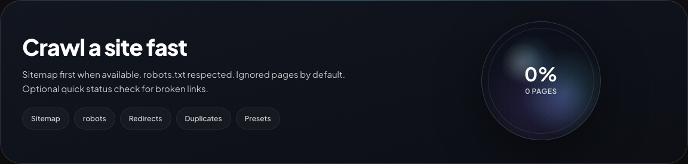

# Cat Crawler

> Crawl a site, test internal navigation, and review redirects, parameter handling, soft failures, and URL-pattern issues in one place.




## What Cat Crawler Is

Cat Crawler is a React frontend plus Node.js backend for website crawl and navigation validation.

It is designed for:
- internal site QA
- launch and regression checks
- redirect and routing reviews
- large-site spot checks where a manual click-through would miss issues

The main UI starts a background crawl job, polls for progress, and then renders the result as a grouped report.

There is also an optional bookmarklet. The bookmarklet does not perform the crawl itself. It opens the deployed Cat Crawler app in a floating panel and passes the current page URL into the app as the starting URL.

Public docs and installer:
- GitHub Pages: [https://carlashub.github.io/site-crawler/](https://carlashub.github.io/site-crawler/)

## What It Is Good For

- Checking internal links and form actions from a real starting URL
- Verifying redirect behaviour, including multi-hop chains and dropped query parameters
- Reviewing query-driven routes with parameter audit enabled
- Finding pages that return `200` but still look broken because content or API requests failed
- Spotting duplicate-looking URL structures and inconsistent naming
- Saving repeatable crawl presets for the same client or site area

## Key Features

- Sitemap-first discovery from `robots.txt` sitemap entries or default `sitemap.xml`
- `robots.txt` enforcement before crawling
- Same-host crawling with optional scope limited to the start path
- Excluded-path rules and language-agnostic per-path crawl limits
- Optional job-page suppression for noisy recruitment sections
- Optional broken-link quick check with HTTP status recording
- Optional parameter audit for query-driven routes
- Redirect audit with chain details, loops, multi-hop chains, parameter loss, and irrelevant destinations
- Soft-failure audit for successful pages that still fail functionally
- URL pattern audit for duplicate structures, legacy/current path pairs, and inconsistent naming
- Impact audit to help prioritise repeated or core-flow issues
- TXT and CSV export from the rendered audit report
- Preset save, export, and import in the browser
- Optional bookmarklet runner for opening the app from the page you are already viewing

## What The Bookmarklet Does

The bookmarklet lives in [`docs/bookmarklet.js`](docs/bookmarklet.js).

Its behaviour is:
- open the **full Cat Crawler panel immediately** (a title bar, **Hide** to collapse to a small control, **Show** to restore)
- load the deployed app in an **iframe** inside that panel (Express static build ships **no** `X-Frame-Options`; third-party `frame-ancestors` on your host is outside this repo)
- pass the current page URL as the `url` query parameter (`?mode=bookmarklet&url=...`)
- show a **loading** state while the iframe loads and an **in-panel error** if it times out
- **reuse one instance**: running the bookmarklet again focuses the same root; if you navigate and run it again, the iframe reloads with the new page URL
- **Close** tears the UI down completely

The public docs site builds the install link from [`docs/config.js`](docs/config.js) and [`docs/install.js`](docs/install.js). The **committed** `docs/config.js` sets `appOrigin` to your production app (currently **Google Cloud Run**: `https://site-crawler-989268314020.europe-west2.run.app`). For local testing only, run `APP_ENV=local node scripts/write-public-config.mjs` (never commit that output). `scripts/validate-committed-docs-config.mjs` rejects loopback or non-HTTPS origins in the tracked file.

## Current Architecture And Run Model

High-level flow:
1. The frontend submits a crawl job to `POST /api/crawl/start`.
2. The backend validates the request and creates a background crawl job.
3. The frontend polls `GET /api/crawl/:jobId` for progress and final results.
4. The frontend renders grouped audit sections and offers TXT or CSV export.

Runtime components:
- `frontend/`: React application served as a built Vite SPA
- `backend/`: Express API and crawl engine
- `docs/`: GitHub Pages docs site and bookmarklet loader

Current background-job model:
- local development defaults to file-backed job state
- staging and production must use Firestore-backed job state
- the UI depends on the background-job endpoints for normal use

## Current Deployment Model And Constraints

Current supported runtime contract:
- Node.js `22.x`

Important operational constraints:
- Staging and production must use `JOB_STATE_BACKEND=firestore`
- All production instances must share the same Firestore backend and collection prefix
- Crawl jobs are rate-limited and capped by backend hard limits
- Active crawl jobs are hard-capped to `2` (`CRAWL_MAX_ACTIVE_JOBS`)
- Frontend controls are aligned to the backend caps: `maxPages` up to `300`, `concurrency` up to `6`
- The crawler is for public `http(s)` targets only; internal, loopback, link-local, and metadata destinations are blocked
- Crawling stays on the same host as the start URL
- The bookmarklet is only a launcher for the app; it does not replace the backend

## Quick Start

### Use The App

1. Open a local run or your deployed Cat Crawler app.
2. Enter a homepage URL such as `https://example.com`.
3. Add any exclude paths you do not want crawled.
4. Add optional path limits for noisy sections.
5. Choose whether to enable broken-link checking or parameter audit.
6. Run the crawl.
7. Review the grouped results and export TXT or CSV if needed.

### Use The Bookmarklet

1. Open the public docs site: [https://carlashub.github.io/site-crawler/](https://carlashub.github.io/site-crawler/)
2. Drag the bookmarklet button to your bookmarks bar.
3. Open the page you want to seed from.
4. Click the bookmarklet to open the full panel with Cat Crawler loaded for the current tab’s URL.

## Main Options Explained Simply

- `Exclude paths`
  Prevents crawling whole sections such as `/jobs` or `/careers`.
- `Crawl limits by path`
  Caps how many pages are crawled under a path such as `/job`.
- `Max pages`
  Total crawl size cap. The UI and backend both cap this at `300`.
- `Concurrency`
  How many crawl workers run at once. The UI and backend both cap this at `6`.
- `Include querystrings`
  Keeps querystring variants in the crawl scope when appropriate.
- `Ignore job pages`
  Suppresses job-heavy pages by default.
- `Broken link quick check`
  Adds live HTTP status checking for discovered navigation targets.
- `Parameter audit`
  Tests how the site handles parameter variants such as `?page=2` or `?filter=value`.
- `URL match filter`
  Filters the rendered results after the crawl is complete.

## Output And Report Sections

- `Audit report`
  The main rendered list of crawled navigation entries with source, referrer, status, and classification.
- `Validation report`
  Summary view of broken URLs, redirect issues, parameter-handling issues, soft failures, and impact issues.
- `Redirect audit`
  Focused view of redirected navigation, including loops, multiple hops, lost params, and irrelevant destinations.
- `Parameter audit`
  Focused view of parameterised URLs and whether parameters were preserved, dropped, or redirected unexpectedly.
- `Soft failures`
  Pages that returned success but still appear broken because content or API behaviour failed.
- `URL patterns`
  Structural grouping for duplicate patterns, legacy/current paths, and inconsistent naming.
- `Issue impact`
  Prioritisation layer for repeated or core-flow issues.
- `Duplicate content candidates`
  Quick grouping of URL variants that may represent duplicate content.

## Honest Limitations And Notes

- Cat Crawler does not claim to replace human QA judgement.
- It only crawls one host per run.
- It only crawls public `http(s)` targets that pass the outbound safety checks.
- Soft-failure detection is heuristic by design. Treat it as review input, not an absolute verdict.
- Pattern and impact analysis help prioritise review. They do not replace manual interpretation.
- The GitHub Pages docs site is static. It must be configured with the correct `BOOKMARKLET_APP_ORIGIN` for a real deployed app before publishing.

## Local Setup

Install dependencies:

```bash
cd frontend
npm ci

cd ../backend
npm ci
```

Build the frontend:

```bash
cd frontend
npm run build
```

Start the backend:

```bash
cd ../backend
npm start
```

Optional: regenerate the local bookmarklet docs config explicitly from the repo root:

```bash
APP_ENV=local node scripts/write-public-config.mjs
```

The local default app origin is `http://localhost:8080`.

## Deployment Notes

### Docker

Build the production image from the repo root:

```bash
docker build -t cat-crawler .
```

The Docker build:
- builds the frontend in a dedicated stage
- installs production backend dependencies in a separate stage
- copies only runtime files into the final image

### Staging And Production

For staging or production:
- set `JOB_STATE_BACKEND=firestore`
- point every instance at the same Firestore backend
- set `TRUST_PROXY` intentionally for the real ingress path
- regenerate `docs/config.js` for the target public app origin before publishing the docs

Example docs config generation:

```bash
APP_ENV=production BOOKMARKLET_APP_ORIGIN=https://site-crawler-989268314020.europe-west2.run.app node scripts/write-public-config.mjs
```

### Google Cloud Run (production app)

The live UI + API for Cat Crawler is deployed separately from GitHub Pages—for example on **[Cloud Run](https://cloud.google.com/run)**. The bookmarklet’s `appOrigin` must match that HTTPS origin (no trailing slash), e.g. `https://site-crawler-989268314020.europe-west2.run.app`.

GitHub Pages only serves the static docs and bookmarklet loader; crawls still run against your Cloud Run service.

### Fly.io (optional)

[`fly.toml`](fly.toml) is only relevant if you choose to deploy with [Fly.io](https://fly.io/) instead of (or in addition to) Cloud Run. Ignore it if you use Cloud Run only.
The project Fly config caps running machines at `2` via `max_machines_running = 2`.

### Doc screenshots (Playwright)

From the repo root, with the app reachable at `BASE_URL` and Playwright installed under `frontend/`:

```bash
cd frontend && npm ci && npx playwright install chromium
# optional if browsers land in a custom dir:
export PLAYWRIGHT_BROWSERS_PATH="$PWD/../.playwright-browsers"
cd ..
BASE_URL=http://127.0.0.1:8080 node scripts/capture-docs-screenshots.mjs
```

PNG outputs are written to `docs/assets/screenshots/`. The same script is wired as `capture-docs-screenshots` in [`scripts/package.json`](scripts/package.json).

### CI And Docs Publish Path

The current CI workflow:
- syntax-checks docs and release helpers
- validates local, staging, and production docs/bookmarklet config generation
- runs backend lint and tests
- runs frontend lint and tests
- builds the production Docker image
- smoke-tests `/healthz`

GitHub Pages content is served from `docs/`. The release docs tooling expects:
- `docs/config.js`
- `docs/install.js`
- `docs/bookmarklet.js`
- `docs/index.html`
- `docs/landing.html`

## Quick API Reference

Primary UI-facing endpoints:
- `POST /api/crawl/start`
- `GET /api/crawl/:jobId`

Health endpoints:
- `GET /healthz`
- `GET /readyz`

There is also a direct crawl endpoint:
- `POST /api/crawl`

Use the background-job endpoints for the normal UI flow.

## Docs And Public Pages

- Public docs site: [https://carlashub.github.io/site-crawler/](https://carlashub.github.io/site-crawler/)
- Public landing page source: [`docs/index.html`](docs/index.html)
- Alternate docs page source: [`docs/landing.html`](docs/landing.html)
- Bookmarklet loader source: [`docs/bookmarklet.js`](docs/bookmarklet.js)

## License

MIT
