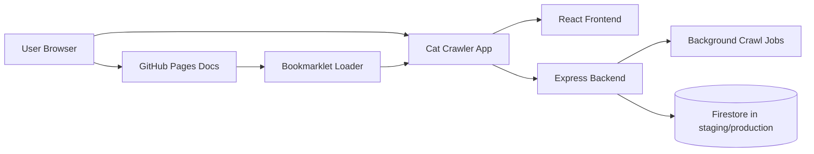

# Cat Crawler

> Crawl a site, test internal navigation, and review redirects, parameter handling, soft failures, and URL-pattern issues in one place.


## What Cat Crawler Is

Cat Crawler is a React frontend plus Node.js backend for website crawl and navigation validation.

It is designed for:
- internal site QA
- launch and regression checks
- redirect and routing reviews
- large-site spot checks where a manual click-through would miss issues

The main UI starts a background crawl job, polls for progress, and then renders the result as a grouped report.

There is also an optional bookmarklet. The bookmarklet does not perform the crawl itself. It opens the deployed Cat Crawler app in a floating panel and passes the current page URL into the app as the starting URL.

Public docs and installer:
- GitHub Pages: [https://carlashub.github.io/site-crawler/](https://carlashub.github.io/site-crawler/)
- Repository: [https://github.com/CarlasHub/site-crawler](https://github.com/CarlasHub/site-crawler)

## What It Is Good For

- Checking internal links and form actions from a real starting URL
- Verifying redirect behaviour, including multi-hop chains and dropped query parameters
- Reviewing query-driven routes with parameter audit enabled
- Finding pages that return `200` but still look broken because content or API requests failed
- Spotting duplicate-looking URL structures and inconsistent naming
- Saving repeatable crawl presets for the same client or site area

## Key Features

- Sitemap-first discovery from `robots.txt` sitemap entries or default `sitemap.xml`
- `robots.txt` enforcement before crawling
- Same-host crawling with optional scope limited to the start path
- Excluded-path rules and language-agnostic per-path crawl limits
- Optional job-page suppression for noisy recruitment sections
- Optional broken-link quick check with HTTP status recording
- Optional parameter audit for query-driven routes
- Redirect audit with chain details, loops, multi-hop chains, parameter loss, and irrelevant destinations
- Soft-failure audit for successful pages that still fail functionally
- URL pattern audit for duplicate structures, legacy/current path pairs, and inconsistent naming
- Impact audit to help prioritise repeated or core-flow issues
- TXT and CSV export from the rendered audit report
- Preset save, export, and import in the browser
- Optional bookmarklet runner for opening the app from the page you are already viewing

## Product Video

<video src="docs/assets/media/site-crawler-demo.webm" controls muted playsinline preload="metadata" poster="docs/assets/screenshots/01-dashboard.png" width="100%"></video>

If GitHub does not render the video inline in your browser, open [the demo video directly](docs/assets/media/site-crawler-demo.webm).

## What The Bookmarklet Does

The bookmarklet lives in [`docs/bookmarklet.js`](docs/bookmarklet.js).

Its behaviour is:
- open the **full Cat Crawler panel immediately** (a title bar, **Hide** to collapse to a small control, **Show** to restore)
- load the deployed app in an **iframe** inside that panel (Express static build ships **no** `X-Frame-Options`; third-party `frame-ancestors` on your host is outside this repo)
- pass the current page URL as the `url` query parameter (`?mode=bookmarklet&url=...`)
- show a **loading** state while the iframe loads and an **in-panel error** if it times out
- **reuse one instance**: running the bookmarklet again focuses the same root; if you navigate and run it again, the iframe reloads with the new page URL
- **Close** tears the UI down completely

The public docs site builds the install link from [`docs/config.js`](docs/config.js) and [`docs/install.js`](docs/install.js). The **committed** `docs/config.js` sets `appOrigin` to the current production app origin: `https://site-crawler-989268314020.europe-west2.run.app`. For local testing only, run `APP_ENV=local node scripts/write-public-config.mjs` (never commit that output). `scripts/validate-committed-docs-config.mjs` rejects loopback or non-HTTPS origins in the tracked file.

## Current Architecture And Run Model

High-level flow:
1. The frontend submits a crawl job to `POST /api/crawl/start`.
2. The backend validates the request and creates a background crawl job.
3. The frontend polls `GET /api/crawl/:jobId` for progress and final results.
4. The frontend renders grouped audit sections and offers TXT or CSV export.

Runtime components:
- `frontend/`: React application served as a built Vite SPA
- `backend/`: Express API and crawl engine
- `docs/`: GitHub Pages docs site and bookmarklet loader

Current background-job model:
- local development defaults to file-backed job state
- staging and production must use Firestore-backed job state
- the UI depends on the background-job endpoints for normal use

## Architecture At A Glance


```mermaid
flowchart LR
  U[User Browser] --> D[GitHub Pages Docs]
  U --> A[Cat Crawler App]
  D --> B[Bookmarklet Loader]
  B --> A
  A --> F[React Frontend]
  A --> E[Express Backend]
  E --> J[Background Crawl Jobs]
  E --> S[(Firestore in staging/production)]
```

## Current Deployment Model And Constraints

Current supported runtime contract:
- Node.js `22.x`

Important operational constraints:
- Staging and production must use `JOB_STATE_BACKEND=firestore`
- All production instances must share the same Firestore backend and collection prefix
- Crawl jobs are rate-limited and capped by backend hard limits
- Active crawl jobs are hard-capped to `2` (`CRAWL_MAX_ACTIVE_JOBS`)
- Frontend controls are aligned to the backend caps: `maxPages` up to `300`, `concurrency` up to `6`
- The crawler is for public `http(s)` targets only; internal, loopback, link-local, and metadata destinations are blocked
- Crawling stays on the same host as the start URL
- The bookmarklet is only a launcher for the app; it does not replace the backend

## Quick Start

### Use The App

1. Open a local run or your deployed Cat Crawler app.
2. Enter a homepage URL such as `https://example.com`.
3. Add any exclude paths you do not want crawled.
4. Add optional path limits for noisy sections.
5. Choose whether to enable broken-link checking or parameter audit.
6. Run the crawl.
7. Review the grouped results and export TXT or CSV if needed.

### Use The Bookmarklet

1. Open the public docs site: [https://carlashub.github.io/site-crawler/](https://carlashub.github.io/site-crawler/)
2. Drag the bookmarklet button to your bookmarks bar.
3. Open the page you want to seed from.
4. Click the bookmarklet to open the full panel with Cat Crawler loaded for the current tab’s URL.

## Main Options Explained Simply

- `Exclude paths`
  Prevents crawling whole sections such as `/jobs` or `/careers`.
- `Crawl limits by path`
  Caps how many pages are crawled under a path such as `/job`.
- `Max pages`
  Total crawl size cap. The UI and backend both cap this at `300`.
- `Concurrency`
  How many crawl workers run at once. The UI and backend both cap this at `6`.
- `Include querystrings`
  Keeps querystring variants in the crawl scope when appropriate.
- `Ignore job pages`
  Suppresses job-heavy pages by default.
- `Broken link quick check`
  Adds live HTTP status checking for discovered navigation targets.
- `Parameter audit`
  Tests how the site handles parameter variants such as `?page=2` or `?filter=value`.
- `URL match filter`
  Filters the rendered results after the crawl is complete.

## Output And Report Sections

- `Audit report`
  The main rendered list of crawled navigation entries with source, referrer, status, and classification.
- `Validation report`
  Summary view of broken URLs, redirect issues, parameter-handling issues, soft failures, and impact issues.
- `Redirect audit`
  Focused view of redirected navigation, including loops, multiple hops, lost params, and irrelevant destinations.
- `Parameter audit`
  Focused view of parameterised URLs and whether parameters were preserved, dropped, or redirected unexpectedly.
- `Soft failures`
  Pages that returned success but still appear broken because content or API behaviour failed.
- `URL patterns`
  Structural grouping for duplicate patterns, legacy/current paths, and inconsistent naming.
- `Issue impact`
  Prioritisation layer for repeated or core-flow issues.
- `Duplicate content candidates`
  Quick grouping of URL variants that may represent duplicate content.

## Honest Limitations And Notes

- Cat Crawler does not claim to replace human QA judgement.
- It only crawls one host per run.
- It only crawls public `http(s)` targets that pass the outbound safety checks.
- Soft-failure detection is heuristic by design. Treat it as review input, not an absolute verdict.
- Pattern and impact analysis help prioritise review. They do not replace manual interpretation.
- The GitHub Pages docs site is static. It must be configured with the correct `BOOKMARKLET_APP_ORIGIN` for a real deployed app before publishing.

## Local Setup

### Prerequisites

- Node.js `22.x`
- npm
- A reachable public website to crawl for testing

### Native Local Run

1. Install dependencies:

```bash
cd frontend
npm ci

cd ../backend
npm ci
```

2. Build the frontend:

```bash
cd frontend
npm run build
```

3. Start the backend:

```bash
cd ../backend
npm start
```

4. Open the app:

- App UI: `http://localhost:8080`
- Health check: `http://localhost:8080/healthz`

5. Optional: regenerate the local bookmarklet docs config explicitly from the repo root:

```bash
APP_ENV=local node scripts/write-public-config.mjs
```

The local default app origin is `http://localhost:8080`.

### Local Run Checklist

- [ ] Use Node `22.x`
- [ ] Run `npm ci` in `frontend/` and `backend/`
- [ ] Build the frontend before starting the backend
- [ ] Confirm `http://localhost:8080/healthz` responds
- [ ] Use `APP_ENV=local` when generating local docs config

### Local Docker Run

Build and run the production-style container locally from the repo root:

```bash
docker build -t cat-crawler .
docker run --rm -p 8080:8080 cat-crawler
```

## Deployment Notes

### Production Architecture

- GitHub Pages serves the static docs and bookmarklet installer only
- The actual crawler app is the Node container built from `Dockerfile`
- The app serves the built frontend and the backend API on the same origin
- Staging and production require shared Firestore-backed job state

### Container Build

```bash
docker build -t cat-crawler .
```

The Docker build:
- builds the frontend in a dedicated stage
- installs production backend dependencies in a separate stage
- copies only runtime files into the final image

### Deploy To A Container Host

This project is designed to run on a container host that can run the repository `Dockerfile`.

Required production contract:
- expose the app on port `8080`
- run the container from this repository `Dockerfile`
- set `JOB_STATE_BACKEND=firestore`
- provide Firestore credentials securely
- publish the app on HTTPS
- point `BOOKMARKLET_APP_ORIGIN` at that final HTTPS app URL when generating docs

### Staging And Production Checklist

- [ ] Build and publish the container image
- [ ] Set `APP_ENV=staging` or `APP_ENV=production`
- [ ] Set `JOB_STATE_BACKEND=firestore`
- [ ] Point every instance at the same Firestore backend and collection prefix
- [ ] Set `TRUST_PROXY` intentionally for the real ingress path
- [ ] Publish the app on HTTPS
- [ ] Regenerate `docs/config.js` for the final public app origin
- [ ] Re-publish the GitHub Pages docs after `docs/config.js` is updated
- [ ] Confirm `/healthz` responds from the deployed app

Key production environment variables come from [`.env.example`](.env.example):
- `APP_ENV`
- `PORT`
- `BOOKMARKLET_APP_ORIGIN`
- `TRUST_PROXY`
- `JOB_STATE_BACKEND`
- `FIRESTORE_CRAWL_JOBS_COLLECTION`
- `CRAWL_MAX_ACTIVE_JOBS`
- rate limit and crawl cap variables as needed

Example docs config generation:

```bash
APP_ENV=production BOOKMARKLET_APP_ORIGIN=https://site-crawler-989268314020.europe-west2.run.app node scripts/write-public-config.mjs
```

## Level-Up Roadmap

Smarter crawl control:
- [ ] Add saved crawl histories with rerun from previous settings.
- [ ] Add advanced include and exclude rules with testable pattern previews.
- [ ] Add per-section crawl summaries so large sites are easier to review at a glance.

Deeper issue analysis:
- [ ] Add clearer issue severity scoring with stronger explanations for why an item matters.
- [ ] Add issue deduplication across related URLs so repeated findings are easier to triage.
- [ ] Add richer page context for failures, including page title, template clues, and stronger source grouping.

Team workflow improvements:
- [ ] Add shareable report views for handoff without exporting raw files first.
- [ ] Add comparison mode between two crawls to spot regressions after a release.
- [ ] Add more preset tooling for client packs, reusable defaults, and faster setup.

## License

MIT
